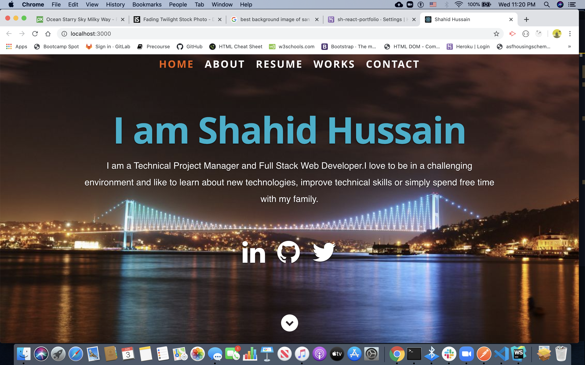
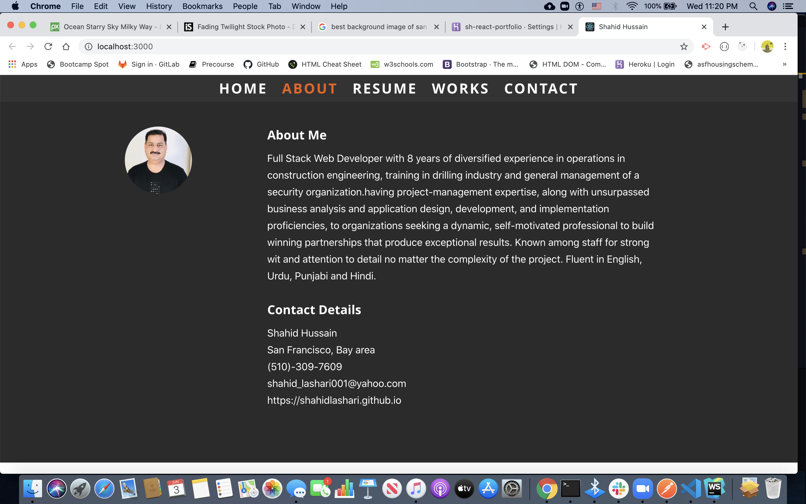
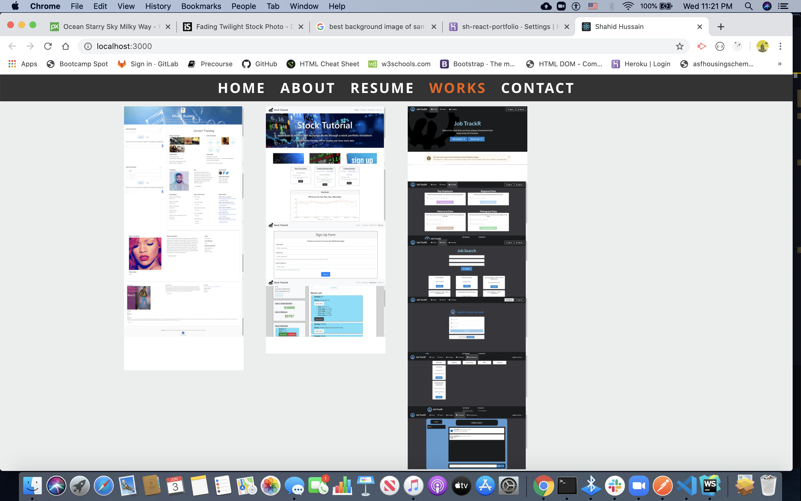
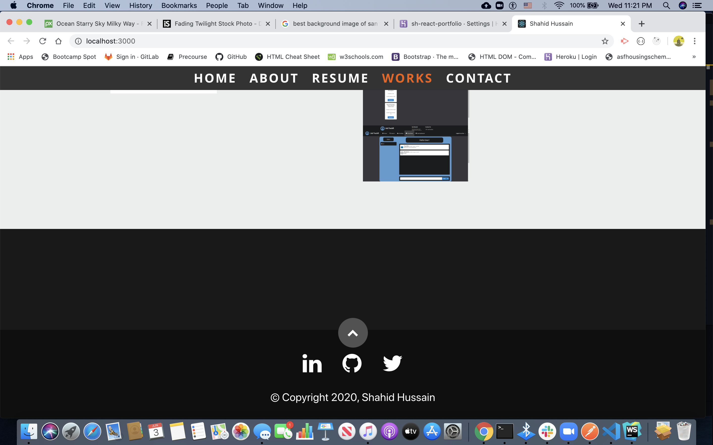

# React Portfolio

URL Links: <https://sh-react-portfolio.herokuapp.com/>
Github deployed: <https://shahidlashari.github.io/React-Portfolio/>

# Description

* The purpose of this assignment was to create a updated portfolio to list all assignments done so far.

* The aim was if anyone looks at the portfolio and get enough informations and can view detailed projects/assigments submitted.

# Technologies

    * HTML
    * CSS
    * React 
    * Bootstrap
    * Visual Studio Code
    * Github
    * Heroku

# Challenges:

This activity was not much difficult just to show what has been done so far.

